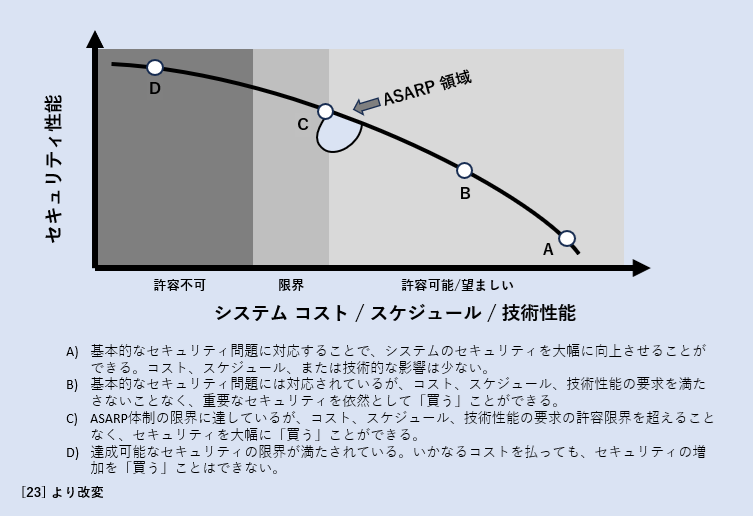

# System Security Concepts / システムセキュリティの概念
> This chapter describes the aspects necessary for a systems engineering perspective on security. A systems engineering perspective on security requires an understanding of the concept of security (Section 3.1), the concept of an adequately secure system (Section 3.2), and the characteristics of systems (Section 3.3). It also requires an understanding of the concept of assets (Section 3.4), the concepts of loss and loss control (Section 3.5), how to reason about asset loss (Section 3.6), and how to determine protection needs (Section 3.7). In satisfying such needs, specific viewpoints (Section 3.8) and how security is demonstrated are considered, including what is adequate (Section 3.9). The systems engineering subdiscipline that encompasses these considerations is referred to as systems security engineering (Section 3.10).

本章では、セキュリティに関するシステムズ エンジニアリングの観点から必要な側面について説明している。セキュリティに関するシステムズ エンジニアリングの観点は、セキュリティの概念（セクション3.1）、適切にセキュアなシステムの概念（セクション3.2）、およびシステムの特性（セクション3.3）についての理解を必要とする。また、資産の概念（セクション3.4）、損失と損失制御の概念（セクション3.5）、資産損失についての推論方法（セクション3.6）、および保護ニーズの決定方法（セクション3.7）についての理解も必要である。そのようなニーズを満たす際には、特定の視点（セクション3.8）と、何が十分か（セクション3.9）を含むセキュリティの実証方法が考慮される。これらの考慮事項を包含するシステムズ エンジニアリングのサブディシプリンは、システムズ セキュリティ エンジニアリング（セクション3.10）として参照される。

## The Concept of Security / セキュリティの概念
> A system with freedom from those conditions that can cause a loss of assets with unacceptable consequences must provide the intended behaviors and outcomes and also avoid any unintended behaviors and outcomes that constitute a loss. The term intended is reflected in two cases, both of which must be satisfied:

資産の損失を引き起こし、受け入れがたい結果に繋がる制約から解放されたシステムは、意図された行動と結果を提供するとともに、損失を構成する意図しない行動と結果を避けなければならない。用語「意図された」は、満たされなければならない二つのケースに反映されている：

> * *User intent*: The system behaviors and outcomes expected by the user

* *ユーザーの意図*：ユーザーが期待するシステムの振る舞いと結果

> * *Design intent*: The system behaviors and outcomes to be achieved by the design

* *設計の意図*：設計によって達成されるべきシステムの振る舞いと結果

> A system that delivers a capability per the design intent but inconsistent with the user intent constitutes a loss. For example, vehicle control loss might result from a failure in the vehicle’s steering control function (i.e., failure to meet the design intent) or through an attack that takes control away from the driver (i.e., failure to meet the user intent).

設計の意図に従って能力を提供するが、ユーザーの意図と矛盾するシステムは損失を構成する。例えば、車両の制御損失は、車両のステアリング制御機能の故障（つまり、設計の意図を満たせない場合）から生じるか、またはドライバーから制御を奪う攻撃（つまり、ユーザーの意図を満たせない場合）によって生じるかもしれない。

> The primary security objective is to ensure that only the intended behaviors and outcomes occur, both with the system and within the system.[^17] Every security need and concern derive from this objective, which is based on the concept of authorization for what is and is not allowed.[^18] As such, the primary security control objective is enforcing constraints in the form of rules for allowed and disallowed behaviors and outcomes. This control objective – and a foundational principle of trustworthy secure design – is Mediated Access. If access is not mediated (i.e., controlled though enforcing constraints) following a set of non-conflicting rules, then no basis exists upon which to claim that security is achieved.

主要なセキュリティの目的は、システムとシステム内で意図された振る舞いと結果のみが発生することを保証することである。[^17j] すべてのセキュリティニーズと懸念は、許可されていることと許可されていないことの認可の概念に基づいてこの目的から派生する。[^18j] そのため、主要なセキュリティ制御の目的は、許可された行動と結果に対するルールの形での制約を強制することである。この制御の目的 - そして信用に値するセキュアな設計の基本原則 - は仲介されたアクセスである。アクセスが仲介されていない（つまり、矛盾しないルールのセットに従って制約を強制することを通じて制御されていない）場合、セキュリティが達成されていると主張する根拠は存在しない。

> The rules for mediated access are stated in a set of security policies[^19] that reflect or are derived from laws, directives, regulations, life cycle concepts,[^20] requirements, or other specifically stated stakeholder objectives. A security policy includes a scope of control that establishes bounds within which the policy applies. Security policy rules are stated in terms of subjects (active entities), objects (passive entities), and the operations that the subject can perform or invoke on the object.[^21] The rules govern subject-to-object and subject-to-subject behaviors and outcomes.

仲介されたアクセスのルールは、法律、指令、規制、ライフサイクルの概念、[^20j] 要件、または他の特定の利害関係者の目的から反映されるか派生する一連のセキュリティポリシー[^19j]に記載されている。セキュリティポリシーには、ポリシーが適用される範囲を確立する制御の範囲が含まれる。セキュリティポリシーのルールは、主体（能動的な実体）、対象（受動的な実体）、および主体が対象に対して行うまたは呼び出すことができる操作の観点で記述される。[^21j] これらのルールは、主体から対象へ、および主体から主体への振る舞いと結果を規制する。

> Each security policy rule must be accurate, consistent, compatible, and complete with respect to stakeholder objectives for the defined scope of control.[^22] Inconsistency, incompatibility, inaccuracy, or incompleteness in the security policy rules lead to protection gaps. It is equally important that the security protection capabilities of the system are aligned with and can achieve the expectations of the policy.

各セキュリティポリシーのルールは、定義された制御の範囲に関して利害関係者の目的と正確に、一貫して、互換性を持ち、完全でなければならない。[^22j] セキュリティポリシーのルールにおける不一致、非互換性、不正確さ、または不完全さは、保護のギャップにつながる。同様に重要なのは、システムのセキュリティ保護能力がポリシーの期待と整合しており、それを達成できることである。

> Privileges[^23] define the set of allowed and disallowed behavior and outcomes granted to a subject.

権限[^23j]は、主体に付与される許可された行動と結果、または許可されない行動と結果のセットを定義する。

> Privileges are the basis for making mediated access decisions. A restrictive default practice for security policy enforcement is to design the enforcement mechanism to allow only what the policy explicitly allows and to deny everything else. For a system to be deemed trustworthy secure, there must be sufficient confidence that the system is capable of enforcing the security policy on a continuous basis for the duration of the time that the policy is in effect (Appendix F).

権限は仲介されたアクセス決定を行うための基盤である。セキュリティポリシーの強制に関する制限的なデフォルトの実践は、ポリシーが明示的に許可するもののみを許可し、それ以外はすべて拒否するように強制メカニズムを設計することである。システムが信用に値するセキュアと見なされるためには、システムがセキュリティポリシーをポリシーが効力を持つ時間の間、継続的に強制する能力があることに十分な確信が必要である（付録F）。

[^17]: > Intended behaviors include interactions. Relevant interactions include human-to-machine and machine-to-machine interactions. Human-tomachine interactions are transformed into machine-to-machine interactions, whereby a machine element operates on behalf of the human.

[^17j]: 意図された行動には相互作用が含まれる。関連する相互作用には、人間と機械の相互作用、および機械同士の相互作用がある。人間と機械の相互作用は、機械同士の相互作用に変換される。この場合、機械の要素が人間の代わりに操作する。

[^18]: > An attacker seeks to produce unauthorized behaviors or outcomes. Attackers attempt to accomplish something that they are not authorized to accomplish, even if that behavior or outcome is authorized for some other entity.

[^18j]: 攻撃者は、許可されていない行動や結果を引き起こそうとする。攻撃者は、たとえその行動や結果が他のエンティティに対して許可されているとしても、彼らが達成することが許可されていない何かを成し遂げようと試みる。

[^19]: > A security policy is a set of rules that govern security-relevant system and system element behavior (Appendix C).

[^19j]: セキュリティポリシーは、セキュリティに関連するシステムおよびシステム要素の行動を規制するルールのセットである（付録C）。

[^20]: > Life cycle concepts include operation, sustainment, evolution, maintenance, training, startup, and shutdown.

[^20j]: ライフサイクルの概念には、運用、維持、進化、メンテナンス、トレーニング、起動、およびシャットダウンが含まれる。

[^21]: > Active entities exhibit behavior (e.g., a process in execution) while passive entities do not (e.g., data, file).

[^21j]: 能動的な実体は行動を示す（例：実行中のプロセス）が、受動的な実体は示さない（例：データ、ファイル）。

[^22]: > At the highest level of assurance, security policies are formally specified and verified.

[^22j]: 最高レベルの保証では、セキュリティポリシーは形式的に指定され、検証される。

[^23]: > Privileges are also referred to as authorizations or rights.

[^23j]: 権限は、認可または権利としても言及される。

## The Concept of an Adequately Secure System / 適切にセキュアなシステムの概念
> Adequate security is a concept that enables meaningful judgments about the idealistic nature of security objectives. The definition of security expresses an ideal that encapsulates three essential characteristics of a secure system:

適切なセキュリティは、セキュリティ目標の理想的な性質に関する意味のある判断を可能にする概念である。セキュリティの定義は、セキュアなシステムの三つの本質的な特徴を包括する理想を表現している：

> * It enables the delivery of the required system capability despite intentional and unintentional forms of adversity.

* 意図的および非意図的な形態の逆境にもかかわらず、要求されるシステム能力の提供を可能にする。

> * It enforces constraints to ensure that only the desired behaviors and outcomes associated with the required system capability are realized while satisfying the first characteristic.

* 第一の特徴を満たしながら、要求されるシステム能力に関連する望ましい行動と結果のみが実現されることを保証するための制約を強制する。

> * It enforces constraints based on a set of rules to ensure that only authorized human-tomachine and machine-to-machine interactions and operations are allowed to occur while satisfying the second characteristic.

* 第二の特徴を満たしながら、許可された人間と機械の相互作用および機械同士の相互作用と操作のみが発生することを保証するための一連のルールに基づいて制約を強制する。

> These characteristics are to be achieved to the extent practicable, resulting in a gap between the ideal secure system and the security performance that the system can dependably achieve.[^24] The judgment that a system is adequately secure[^25] requires an evidence-based determination that security performance is optimized against all other performance objectives and constraints. The scope of conditions relevant to security and the acceptable level of security are specific to stakeholder needs. To be adequately secure, the system:

これらの特徴は実際に可能な限り達成されるべきであり、理想的なセキュアなシステムとシステムが信頼性を持って達成できるセキュリティのパフォーマンスとの間にギャップが生じる。[^24j] システムが適切にセキュアである[^25j]という判断は、セキュリティのパフォーマンスが他のすべてのパフォーマンス目標および制約に対して最適化されていることを示す証拠に基づく決定を必要とする。セキュリティに関連する制約の範囲と許容されるセキュリティのレベルは、利害関係者のニーズに特有のものである。適切にセキュアであるためには、システムは以下を満たす：

> * Meets minimum tolerable levels[^26] of security, as determined by experience, analysis, or a combination of both

* 経験、分析、またはその両方によって決定されたセキュリティの最小許容レベル[^26j]を満たす

> * Is as secure as reasonably practicable (ASARP)

* 合理的に実行可能な限りセキュアである（ASARP）

[^24]: > Because system security is asymmetric – that is, things can be observed to be insecure, but no observation allows one to declare an arbitrary system secure [22] – the ideal cannot be achieved without some uncertainty.

[^24j]: システムセキュリティは非対称的であるため – つまり、セキュアでないことは観察できるが、任意のシステムをセキュアだと宣言する観察はできない [22] – 理想はある程度の不確実性なしには達成されない。

[^25]: > The concept of adequately secure is an adaptation of the concept of adequately safe from [23].

[^25j]: 適切にセキュアという概念は、適切に安全という概念からの適応である [23]。

[^26]: > Below such levels, the system is considered insecure.

[^26j]: そのようなレベル以下では、システムはセキュアでないと見なされる。

> As secure as reasonably practicable means that an incremental improvement in security would require a disproportionate deterioration of meeting other system cost, schedule, or performance objectives; would violate system constraints; or would require unacceptable concessions such as an unacceptable change in the way operations are performed.

合理的に実行可能な限りセキュアであることは、セキュリティの漸進的な改善が他のシステムのコスト、スケジュール、またはパフォーマンスの目標を不均衡に損なうことを要求することを意味し、システムの制約に違反するか、または運用方法の受け入れがたい変更のような受け入れがたい譲歩を要求するであろう。

> An adequately secure system does not necessarily preclude all of the conditions that can lead to or result in undesirable consequences. The minimum tolerable levels of security performance and interpretations of as secure as reasonably practicable may not be fixed for the life of a system.

適切にセキュアなシステムが、望ましくない結果につながるか、またはそれによって生じるすべての条件を必ずしも排除するわけではない。セキュリティパフォーマンスの最小許容レベルや、「合理的に実行可能な限りセキュアである」という解釈は、システムの寿命にわたって固定されているわけではないであろう。

> The information gathered while the system is in use and the lessons learned may guide and inform modifications that raise the bar on either or both (tolerability and practicability).

システムが使用されている間に収集された情報や得られた教訓は、どちらか一方、あるいは両方（許容性と実用性）のレベルを上げるような改良の指針や情報になるかもしれない。

> The concept of adequately secure is, therefore, inherently context-dependent, and subjective in nature. It is based on assertions and expectations about the system security objectives and determining how well those objectives have been achieved. Figure 4 illustrates the trade-offs between system security and the cost, schedule, and technical performance of the system.

したがって、「適切にセキュア」という概念は、本質的に文脈依存であり、主観的な性質を持つ。これは、システムのセキュリティ目標に関する言明と期待に基づいており、それらの目標がどの程度達成されているかを判断することに基づいている。図4は、システムのセキュリティとシステムのコスト、スケジュール、技術性能との間のトレードオフを示している。

Fig. 4. System Security and Cost/Schedule/Technical Performance

Judging the adequacy of system security requires an understanding of system states. All systems operate in and transition between a set of states. These states and transitions may correspond to or be defined by characteristics of the system, such as how the system functions (e.g., start, run, idle, recovery), how the system is used (e.g., operational, training, maintenance, peacetime, wartime), and by environmental conditions (e.g., under fire or not, temperature ranges). There are security characteristics that determine whether each state or transition is secure, insecure, or indeterminate (i.e., unknown whether secure or insecure). Adequate security depends on being able to distinguish among secure, insecure, and indeterminate states and to keep the system operating in secure states by applying the principles of Protective Failure and Protective Recovery.

System states may be secure states (i.e., what states are desired and allowed) and insecure states (i.e., what states are not desired nor allowed). Ideally, a secure system is a system that begins execution in a secure state and does not transition to an insecure state. That is, every state transition results in the same or another secure state. Each state transition must also be secure.

Figure 5 illustrates a subset of these idealized secure system state transitions.

Fig. 5. Idealized Notional Secure System State Transitions

Protective failure requires the ability to (1) detect that the system is in an insecure state and (2) detect a transition that will place the system into an insecure state for the purposes of responding to avoid the propagation of new failure. Protective failure calls for responsive and corrective actions, including (when needed) transitioning to a secure halt state with a protected recovery to allow for the continuation of operations in a reconstituted, reconfigured, or alternative secure operational mode. Other stakeholder objectives may necessitate the continuation of operations in a less-than-fully-secure state and should be reflected as necessary in such things as policy and requirements (Section C.3).

Protective recovery requires the ability to take reactive, responsive, or corrective action to securely transition from an insecure state to a secure state (or a less insecure state). The secure state achieved after completing protective recovery actions includes those actions that limit or prevent any further state transition and those that constitute a type of degraded capability, mode, or operation.

## Characteristics of Systems / システムの特徴
The characteristics of systems, their interrelationships with other systems, and their roles within a system of systems all impact security and determinations of adequate security and system trustworthiness. These system characteristics can include:
* System type, function, and primary purpose
* System technological, mechanical, physical, and human element characteristics
* System states and modes of operation
* Criticality or importance of the system
* Ramifications of the system’s failure to meet its performance expectations, to function correctly, to produce only the intended behaviors and outcomes, and to provide for its own protection (i.e., self-protection)[^27]
* System concept for the delivery of a capability
* Approach to acquisition of the system
* Approach to managerial and operational governance
* Value, sensitivity, and criticality of assets entrusted to and used by the system
* The system’s interfaces and the interfacing systems that interact through those interfaces
* Role as a constituent system in one or more system of systems

## The Concept of Assets / 資産の概念
An asset is an item of value. There are many different types of assets. Assets are broadly categorized as either tangible or intangible. Tangible assets include physical items, such as hardware, computing platforms, other technology components, and humans. Intangible assets include humans, firmware, software, capabilities, functions, services, trademarks, intellectual property, data, copyrights, patents, image, or reputation.28 Within asset categories, assets can be further identified and described in terms of common asset classes as illustrated in Table 1.

Table 1. Common Asset Classes

| ASSET CLASS / 資産クラス | DESCRIPTION LOSS / 損失の説明 | PROTECTION CRITERIA / 保護規準 |
|----|----|----|
| MATERIAL RESOURCES AND INFRASTRUCTURE | This asset class includes physical property (e.g., buildings, facilities, equipment) and physical resources (e.g., water, fuel). It also includes the basic physical and organizational structures and facilities (i.e., infrastructure) needed for an activity or the operation of an enterprise or society.[^29] An infrastructure may be comprised of assets in other classes. For example, the National Airspace System (NAS) may be considered infrastructure that itself is a system and contains other elements that are forms of systems and infrastructures, such as Air Traffic Control, navigational aids, weather aids, airports, and the aircraft that maneuver within the NAS. | Material resources are protected from loss if they are not stolen, damaged, or destroyed or are able to function or be used as intended, as needed, and when needed. Infrastructure is protected from loss if it meets performance expectations while delivering only the authorized and intended capability and producing only the authorized and intended outcomes. |
| 物質的資源とインフラ | この資産クラスには物理的財産（例：建物、施設、機器）と物理的資源（例：水、燃料）が含まれる。また、活動や企業または社会の運営に必要な基本的な物理的及び組織的構造と施設（すなわちインフラ）も含まれる。[^29]インフラは他のクラスの資産で構成されている可能性がある。例えば、国家航空システム（NAS）はそれ自体がシステムであり、航空交通管制、航法支援、気象支援、空港、及びNAS内を操縦する航空機といった形態のシステムやインフラの他の要素を含むインフラと考えることができる。 | 物質的資源は盗難、損傷、破壊されていない場合、または意図した通りに機能し、必要な時に使用可能な場合に損失から保護されている。インフラは、認可された、意図した能力のみを提供し、認可された、意図した結果のみを生み出す間、性能の期待を満たす場合に損失から保護されている。 |
| SYSTEM CAPABILITY | This asset class is the set of capabilities or services provided by the system. Generally, system capability is determined by (1) the nature of the system (e.g., entertainment, vehicular, medical, financial, industrial, or recreational) and (2) the use of the system to achieve mission or business objectives. | System capability is protected from loss if the system meets its performance expectations while delivering only the authorized and intended capability and producing only the authorized and intended outcomes. |
| システム能力 | この資産クラスはシステムによって提供される能力またはサービスのセットである。一般的に、システム能力は（1）システムの性質（例：エンターテイメント、車両、医療、金融、工業、レクリエーションなど）と（2）ミッションやビジネス目的を達成するためのシステムの使用によって決定される。 | システム能力は、認可された、意図した能力のみを提供し、認可された、意図した結果のみを生み出す間、その性能の期待を満たす場合に損失から保護されている。 |
| HUMAN RESOURCES | This asset class includes personnel who are part of the system and are directly or indirectly involved with or affected by the system. The consequences of loss associated with the system may significantly change the importance of this asset class (e.g., the effect on personnel due to a failure of a guidance system in an aircraft is significantly different from the effect on personnel due to the breach of a system that compromises individual credit card information). | Human resources are protected from loss if they are not injured, suffer illness, or killed. |
| 人的資源 | この資産クラスには、システムの一部であり、直接的または間接的にシステムに関与するか影響を受ける人員が含まれる。システムに関連する損失の結果は、この資産クラスの重要性を著しく変化させる可能性がある（例：航空機の誘導システムの故障による人員への影響と、個人のクレジットカード情報の漏洩による人員への影響は著しく異なる）。 | 人的資源は、負傷、疾病、死亡していない場合に損失から保護されている。 |
| INTELLECTUAL PROPERTY[^30] | This asset class includes trade secrets, recipes, technology,[^31] and other items that constitute an advantage over competitors. The advantage is domain-specific and may be referred to as a competitive advantage, technological advantage, or combative advantage. | Intellectual property is protected from loss if it is not stolen, corrupted, destroyed, copied, substituted in an unauthorized manner, or reverse-engineered in an unauthorized manner. |
| 知的財産[^30] | この資産クラスには、企業秘密、レシピ、技術[^31]、競争相手に対する優位性を構成するその他の項目が含まれる。この優位性はドメイン特有のものであり、競争上の優位性、技術的優位性、または戦闘的優位性として言及されることがある。 | 知的財産は、盗まれず、腐敗しない、破壊されない、無許可でコピーされない、無許可で不正に代替されない、または無許可で逆エンジニアリングされない場合に、損失から保護されている。 |
| DATA AND INFORMATION | This asset class includes all types of data and information (aggregations of data) and all encodings and representations of data and information (e.g., digital, optical, audio, visual). There are general sensitivity classes of data and information that do not fall within the above categories, such as classified information, Controlled Unclassified Information (CUI), and unclassified data and information. | Data and information are protected from loss due to unauthorized alteration, exfiltration, infiltration, and destruction. |
| データと情報 | この資産クラスには、すべてのタイプのデータと情報（データの集合）およびデータと情報のすべての符号化と表現（例：デジタル、光学、音声、視覚）が含まれる。上記のカテゴリーに該当しないデータと情報の一般的な感度クラスがあり、例えば、機密情報、管理された未分類情報（CUI）、未分類のデータと情報がある。 | データと情報は、無許可での変更、抜き取り、浸入、および破壊から損失を受けないよう保護されている。 |
| DERIVATIVE NONTANGIBLES | This asset class is comprised of derivative, nontangible assets, such as image, reputation, and trust. These assets are defined, assessed, and affected – positively and negatively – by the success or failure to provide adequate protection for assets in the other classes. | Non-tangible assets are protected from loss by ensuring the adequate protection of assets in the other classes. |
| 派生的無形資産 | この資産クラスは、イメージ、評判、信用などの派生的で無形の資産で構成される。これらの資産は、他のクラスの資産の適切な保護の提供の成功または失敗によって、肯定的にも否定的にも定義され、評価され、影響を受ける。 | 無形資産は、他のクラスの資産を適切に保護することによって、損失から保護されている。 |

Assets may also be considered as individual items or as an aggregate or group of items that spans asset types or asset classes (e.g., personnel data, fire control function, environmental sensor capability). This publication uses the term asset of interest to emphasize and establish bounds on the scope of reasoning for a specific asset, asset type, or asset class. The valuation of an asset is a key input in decision-making about investments to protect an asset (Section 3.6). For those cases where an asset is associated with multiple stakeholders, there may be differing, contradictory, competing, or conflicting views about the valuation that must be resolved.

[^27]: To the extent feasible, self-protection is a required capability that enables the system to deliver the required stakeholder capabilities while also protecting their assets against loss and the consequences of loss.

[^28]: Humans are perhaps the most important and valuable of all intangible assets. Safety and security explicitly consider the human asset.

[^29]: Adapted from the Merriam Webster and Oxford definitions of infrastructure.

[^30]: The term intellectual property is defined as an output of a creative human thought process that has some intellectual or informational value [24]. Examples include microcomputer design and computer programs.

[^31]: The term technology is defined as the application of scientific knowledge, tools, techniques, crafts, systems, or methods of organization to solve a problem or achieve an objective [25].

## The Concepts of Loss and Loss Control / 損失と損失コントロールの概念
Loss is the experience of having an asset taken away or destroyed or the failure to keep or to continue to have an asset in a desired state or form.[^32] A loss typically results from an adverse event or condition that causes unacceptable ramifications, consequences, or impacts. A specific loss is determined and assessed independent of the causal events and conditions necessary to produce the loss (i.e., the triggering event, such as an error of omission, or the exploitation event, such as an attack). Examples of resultant adverse events or conditions and their ramifications, impacts, or consequences include:
* Adverse event or condition: Data is stolen or inadvertently disclosed on a public website and is no longer solely in the possession of the owner or entities authorized by the owner.
* Ramification, impact, or consequence: Market share and competitive advantage is taken away because the data that was lost or stolen provided detailed instructions for a precision machining method that no other company possessed.
* Adverse event or condition: A vehicle gets a flat tire, which no longer supports the vehicle weight.
* Ramification, impact, or consequence: One cannot drive the vehicle and needs alternate transportation to get to work, the store, or go on vacation.
* Adverse event or condition: Confidence in the system of interest operating correctly is lost or questioned.
* Ramification, impact, or consequence: Trust in the system and its outputs is lost, whether the loss of confidence is justified or not.

While the loss condition or event is negative relative to the intended norm, the effect of the loss can be either neutral/inconsequential or negative/consequential. For example, a flat tire on a vehicle that is used only for off-road excursion is neutral/inconsequential if no such excursion is planned or affected.

Loss may occur because of a single or combination of intentional or unintentional causes, events, and conditions. These may include the authorized or unauthorized use of the system; intentional acts of disruption or subversion; human and machine faults, errors, and failures; human acts of misuse and abuse; and the by-product of emergence, side effects, and feature interaction. These losses may be inconsequential to the mission or business objectives that the system supports. The objectives may still be achieved despite suffering an immediate or eventual loss that impacts other stakeholder objectives.

The potential to experience loss suggests the need for loss control objectives that serve as the basis for judgments about effectively addressing the prevention and limiting of loss. This includes the resultant adverse events and conditions and their ramifications. The loss control objectives also serve as the basis to acquire evidence of assurance that the system as designed, built, used, and sustained will adequately protect against loss while achieving its design intent.

[^32]: Adapted from the Merriam Webster definition of loss.

The loss control objectives reflect an ideal to preserve the assets’ characteristics (i.e., state, condition, form, utility) to the extent practicable despite the potential for those characteristics to be changed. The objectives accept uncertainty in the form of limits to what can be done (i.e., not all losses can be avoided) and limits to the effectiveness of what is done (i.e., anything done has its scope of effectiveness and set of potential failure modes).

Due to uncertainty, it is not possible to guarantee that some form of loss will not occur. There is a need to emphasize protection against the effects of loss, including cascading or ripple events (i.e., the immediate effect of a loss causes some additional unintended or undesired effects or causes additional losses to occur). Thus, holistically protecting against loss and the unintended or undesired effects of loss considers the full spectrum of possible loss across types of losses and loss effects associated with each asset class. This is important considering that all forms of adversity are not knowable. Therefore, it is prudent to ensure that there is focus on the effect to be controlled rather than on the cause when protecting against loss.

The loss control objectives in Table 2 address the possibilities to control the potential for loss and the effects of loss given the limits of certainty, feasibility, and practicality. Collectively, the loss control objectives include the concerns attributed to security and to system survivability, safety, and resilience. Note that satisfying loss control objectives may require trade-offs.

Avoiding or limiting the loss of one asset may come at the expense of not avoiding or limiting the loss of another asset, as well as having trade-offs with other objectives (e.g., cost and schedule).

|  | 目的論議 |

Table 2. Loss Control Objectives
| LOSS CONTROL / 損失制御 | OBJECTIVE DISCUSSION / 目的の議論 |
|----|----|
| LOSS PREVENTION (Prevent the loss from occurring) | * This is the case where a loss is totally avoided. That is, despite the presence of adversity: &nbsp;&nbsp;- The system continues to provide only the intended behavior and produces only the intended outcomes. &nbsp;&nbsp;- The desired properties of the system and assets used by the system are retained. &nbsp;&nbsp;- The assets continue to exist. * Loss avoidance may be achieved by any combination of: &nbsp;&nbsp;- Preventing or removing the event or events that cause the loss &nbsp;&nbsp;- Preventing or removing the condition or conditions that allow the loss to occur &nbsp;&nbsp;- Not suffering an adverse effect despite the events or conditions * Terms such as avoid, continue, delay, divert, eliminate, harden, prevent, redirect, remove, tolerate, and withstand are typically used to characterize approaches to achieving this objective such that a loss does not occur despite the system being subjected to adversity. * The term tolerate refers to the objective of fault/failure tolerance, whereby adversity in the form of faults, errors, and failures is rendered inconsequential and does not alter or prevent the realization of authorized and intended system behavior and outcomes (i.e., the faults, errors, and failures are tolerated). |
| 損失予防（損失が発生するのを防ぐ） | * 損失が完全に避けられるケースである。つまり、逆境が存在しても： &nbsp;&nbsp;-  システムは意図した行動のみを提供し、意図した結果のみを生み出す。 &nbsp;&nbsp;-  システムが使用する資産の望ましい特性が維持される。 &nbsp;&nbsp;-  資産は存在し続ける。 * 損失回避は、次のいずれかの組み合わせによって達成されるかもしれない： &nbsp;&nbsp;-  損失を引き起こすイベントを防ぐ、または取り除く &nbsp;&nbsp;-  損失が発生する条件を防ぐ、または取り除く &nbsp;&nbsp;-  イベントや条件にもかかわらず、悪影響を受けない * 避ける、続ける、遅らせる、逸らす、排除する、強化する、防ぐ、転換する、取り除く、耐える、耐え抜くなどの用語は、システムが逆境にさらされても損失が発生しないようにする目的を達成するアプローチを特徴付けるために一般的に使用される。 * 耐えるという用語は、故障/障害耐性の目的を指し、故障、エラー、障害という形の逆境が無意味にされ、承認された意図されたシステム行動と結果の実現を変更または防ぐことがない（つまり、故障、エラー、障害が耐えられる）。 |
| LOSS LIMITATION (Limit the extent of the loss) | * This covers cases where a loss can or has occurred, and the extent of loss is to be limited. * The extent of loss can be limited in terms of any combination of the following:  &nbsp;&nbsp;- Limited dispersion (e.g., migration, propagation, spreading, ripple, domino, or cascading effects) &nbsp;&nbsp;- Limited duration (e.g., milliseconds, minutes, hours, days) &nbsp;&nbsp;- Limited capacity (e.g., diminished utility, delivery of function, service, or capability) &nbsp;&nbsp;- Limited volume (e.g., bits or bytes of data/information) * Decisions to limit the extent of loss may require prioritizing what constitutes acceptable loss across a set of losses, whereby the objective to limit the loss for one asset requires accepting a loss of some other asset. * The extreme case of loss limitation is to avoid destruction of the asset. * Terms such as tolerate, withstand, remove, continue, constrain, stop/halt, and restart fall into this category in the case where the loss occurs and the system can, or enables the ability to, limit the effect of the loss. * Loss recovery and loss delay are two means to limit loss: &nbsp;&nbsp;- Loss Recovery: Action is taken by the system or enabled by the system to recover (or allow the recovery of) some or all of its ability to function (i.e., behave, interact, produce outcomes) and to recover assets used by the system (e.g., re-imaging, reloading, or recreating data and information, including software in the system). The restoration of the asset, fully or partially, can limit the dispersion, duration, capacity, or volume of the loss. &nbsp;&nbsp;- Loss Delay: The loss event is avoided until the adverse effect is lessened or when a delay enables a more robust response or quicker recovery. * System and environmental conditions may be assumed to result in loss, but measures are taken to limit impacts. * Terms such as contain, recover, restore, reconstitute, reconfigure, and restart are typically used to characterize approaches to achieving this objective. |
| 損失限定（損失の範囲を限定する） | * これは損失が発生するか、または発生しており、その範囲を限定する場合をカバーする。 * 損失の範囲は、以下の組み合わせのどれかによって限定することができる： &nbsp;&nbsp;-  限定された拡散（例：移動、伝播、広がり、波及効果、ドミノ効果、またはカスケード効果） &nbsp;&nbsp;-  限定された期間（例：ミリ秒、分、時間、日） &nbsp;&nbsp;-  限定された能力（例：効用の低下、機能の提供、サービス、または能力） &nbsp;&nbsp;-  限定された量（例：データ/情報のビットまたはバイト） * 損失の範囲を限定するという決定は、損失のセットにわたって受け入れられる損失とは何かを優先することを要求するかもしれない。一つの資産の損失を限定する目標は、他の資産のいくつかの損失を受け入れることを必要とする。 * 損失限定の極端なケースは、資産の破壊を避けることである。 * 損失が発生し、システムが損失の影響を限定する能力を持つ、またはそれを可能にする場合に、耐える、耐える、取り除く、続ける、制約する、停止/中断する、再開するといった用語がこのカテゴリーに分類される。 * 損失回復と損失遅延は損失を限定する手段である： &nbsp;&nbsp;-  損失回復：システムによって、またはシステムによって可能にされた行動が取られ、いくつかまたは全ての機能（すなわち、振る舞い、相互作用、結果の生産）を回復し、システムによって使用される資産（例：再イメージング、再読み込み、またはデータおよび情報の再作成、システム内のソフトウェアを含む）を回復する。 &nbsp;&nbsp;-  損失遅延：損失イベントは、有害な影響が減少するか、遅延がより強固な対応またはより迅速な回復を可能にするまで避けられる。 * システムおよび環境条件は損失につながると仮定されるが、影響を限定するための措置が取られる。 * 含める、回復する、復元する、再構成する、再設定する、再開するなどの用語は、通常、この目標を達成するアプローチを特徴づけるために使用される。 |

## Reasoning about Asset Loss / 資産損失についての推論
As shown in Figure 6, the elements of a structured approach to reason about asset loss include the (1) context of loss, (2) confidence in addressing loss, (3) significance of loss, (4) addressing loss, and (5) cause of loss. The elements provide an asset-protection basis to determine the objectives for a secure system, optimize the system protection capability, and judge the overall suitability and effectiveness of the implemented protections.[^33] The elements are also grouped into two objectives to facilitate reasoning about the asset of interest:
* **Objective 1**: Determine asset protection needs
  * Context of Loss: The scope and criteria that bounds reasoning about asset loss
  * Significance of Loss: The effect of asset loss (or consequences) based on its valuation[^34]
  * Confidence in Addressing Loss: The assurance to be achieved based on claims-driven and evidence-based arguments about the effectiveness of what is done to address potential and actual loss
* **Objective 2**: Satisfy asset protection needs
  * Cause of Loss: The events, conditions, or circumstances that describe what has happened before and what can happen in the future that constitute the potential for loss to occur
  * Addressing Loss: The various actions taken to exercise control over loss to the extent practicable. The control objectives are to prevent loss from occurring and to limit the extent and duration for those losses that do occur. Limiting loss includes recovery from loss to the extent practicable.

[^33]: Applying the asset reasoning approach works equally to reason about assets in terms of mission (i.e., mission-driven asset reasoning), organization (i.e., organization-driven asset reasoning), and enterprise (i.e., enterprise-driven asset reasoning).

[^34]: Valuation is a stakeholder determination. Factors that stakeholders may consider include the various costs associated with the asset and the effects of loss. The effects of loss may be short-term (e.g., completing a business transaction) or long-term (e.g., extended loss of capability awaiting replacement of asset).

Fig. 6. Reasoning about Asset Protection

The asset of interest is the asset class, asset type, or individual asset being addressed. Reasoning about loss is based on the asset of interest. Distinguishing the asset of interest from all other assets provides clarity in the interpretation of loss for the asset of interest and the associated judgments of the suitability and effectiveness of protections employed. A focus on a specific asset class, type, or discrete element also enables precise traceability to requirements that support the analysis needed to determine the protection-relevant impact of changes to requirements.

The context of loss establishes the boundary, scope, and time frame for the reasoning, analyses, assessments, and conclusions about the asset of interest. The context of loss also provides a basis to relate and trace asset dependencies and interactions and to group assets for protection. The context of loss time frame is particularly important because the asset of interest has a life cycle[^35] that is different from the system of interest.[^36] For example, the asset of interest may be created, configured, or modified outside of the scope of control of the system of interest yet be within the scope of the engineering effort. The asset of interest, once within the scope of control of the system of interest, may have differing protection needs associated with the state or mode of the system (e.g., the system operational mode protection may differ from the system training mode).

Additionally, system life cycle assets (Section 3.8) may only exist within a development or production system and their associated supporting environments. The effect of the loss for these assets may transfer to a loss associated with the system of interest. Therefore, the context of loss includes the life cycle of the asset, the state and mode of the system, and other time-based periods or characteristics during which loss is addressed.

> [!NOTE]
> **TIME FRAME OF LOSS – AN EXAMPLE**
> 
> > A financial portfolio (i.e., an asset or collection of assets) with specific investment objectives and risk acceptance considerations may be created by a financial advisor for a client, funded by the client, and subsequently managed using multiple systems across one or more institutional investment firms throughout the portfolio’s life cycle. Each asset of interest within the portfolio may have differing protection needs at different times depending on the type of asset, market conditions, regulatory jurisdiction, risk position, and other asset management factors that are imposed on the system.
> 

The significance of loss is the adverse effect (consequence) on the asset of interest or the resultant adverse effect associated with the asset. The significance of loss is best described as an experience that is to be avoided, thereby warranting an investment to protect against the loss occurring and to minimize the extent of the adverse effect should the loss occur. The significance of loss is determined and assessed as an effects-based judgment. That is, it is determined without any consideration of how or why the loss occurs, the probability or likelihood of the loss occurring, and any intent or the absence of intent related to the loss.[^37]

The significance of loss answers the following questions:
* What are the ramifications, effects, and problems that result from suffering a loss of the asset of interest?
* What is the severity of those ramifications, effects, and problems?

[^35]: The lifetime of an asset may be different from the lifetime of the system. Assets may predate the system and may persist after the system’s retirement from use. The significance of the loss of an asset can have ramifications that are independent of the system, system function, and business and mission objectives.

[^36]: The asset life cycle is the same as the system life cycle when the asset of interest is the system of interest. The asset life cycle may be the same or shorter than the system life cycle for those assets created by the system of interest and only required while the system of interest is operating.

[^37]: Determining the significance of loss is not a determination of risk.

The significance of loss requires clarity in what loss means for the asset of interest. Examples of terms used to describe asset loss include ability, accessibility, accuracy, assurance, advantage (technological, competitive, combatant), capability, control, correctness, existence, investment, ownership, performance, possession, precision, quality, satisfaction, and time.

> [!NOTE]
> **SIGNIFICANCE OF LOSS – AN EXAMPLE**
> > The significance of loss due to a flat tire is determined and assessed without consideration for how or why the tire became flat (e.g., puncture, manufacturing defect, impact with curb or other object) and without any consideration of malicious intent (e.g., tire cut, valve stem loosened). Regardless of how or why the tire became flat, the significance of loss remains the same (e.g., loss of control if the vehicle is moving, inability to drive if the vehicle is stationary, time lost to replace or repair the tire to make the vehicle operable).
> 
> 
> 
> > The significance of loss due to a flat tire includes the inability to steer the vehicle, and the resultant adverse effect may be to impact some other object (i.e., a crash). The adverse effect of the loss of steering (loss of control) is specific, while the adverse effect of a crash is general (many other circumstances may result in a crash without any loss of the ability to steer the vehicle).
> 
> 

Confidence in addressing loss ensures that protections have a body of objective evidence that demonstrates the effectiveness, sufficiency, and suitability of protective measures to satisfy asset protection needs. Confidence in addressing loss is cumulative. It begins with determining the loss concerns for the asset of interest and continuously builds as those concerns are better understood and addressed across the context of loss, the significance of loss, the causes of loss, and how loss is addressed. The evidence basis that provides confidence is informed by the verification and validation activities that occur throughout the life cycles of the assets and the system, including requirements elicitation and analysis. A key informing element to those activities is to ensure that the results contribute to the confidence sought.

The cause of loss[^38] is the individual or combination of events, conditions, and circumstances that result in some form of loss of an asset. The causes of asset loss constitute a continuum that includes intentional, unintentional, accidental, incidental, misuse, abuse, error, defect, fault, weakness, and failure events and conditions [26]. This continuum spans all human-based, machine-based, physical-based, and nature-based drivers of loss. The following considerations apply to reasoning about the causes of loss:
* Single events and conditions that alone can produce the loss
* Combinations, sequences, and aggregate events and conditions

[^38]: Many terms are used to describe the cause of asset loss. Some of these terms are specific to a community of interest or specialty field, while others span communities and specialties. There are also cases where the same term may be used differently across communities and specialty fields (e.g., the term threat has varying interpretations across communities, such as physical security, cybersecurity, commerce, law enforcement, industry, military combat operations, and military intelligence). The terms used as a synonym for the cause of asset loss include attack, breach, compromise, hazard, mishap, threat, violation, and vulnerability.

* Events and conditions that are desirable, intended, and even planned yet produce unanticipated, unforeseen, and unpredictable results
* Cascading and ripple events and conditions
Finally, the causes of asset loss answer the following questions:
* How can loss occur?
* How has loss occurred in the past?

However, determining how loss can occur does not require asking or answering the question, “What is likely or probable to happen?”[^39]

Addressing loss occurs through the protective measures that enforce constraints to ensure that only authorized and intended behaviors and outcomes of the system occur. These include:
* Protective measures that are provided by the machine portion of the system (i.e., the system architecture and design, the use of engineered features and devices within the architecture and design)
* Protective measures that are provided by the human in the system (i.e., personnel, practices, procedures, the use of tools to support the human as a system element, and the human role in designing and building the machine part of the system)
* Protective measures that are provided by the physical environment (i.e., controlled access areas, facility access points, physical monitoring, environmental controls, fire suppression)

The terminology used to describe means and methods includes mechanisms, configurations, controls, safeguards, countermeasures, features, techniques, overrides, practices, procedures, processes, and inhibits. These may be applied in accordance with governing policies, regulations, laws, practices, standards, and techniques.

[^39]: This point distinguishes analysis of what can happen from a risk assessment that determines probability greater than zero and less than one that the adverse event will happen.

> [!]NOTE
> ASSET-BASED PROTECTION – ENGINEERING FOR SUCCESS
> > Do not focus on what is likely to happen. Instead, focus on what can happen, and be prepared. That is what systems security engineering means by adopting a preemptive and reactive strategy (Section D.2) in the form of a concept of secure function that addresses the spectrum of asset loss and associated consequences.
> 
> 
> 
> > This means proactively planning and designing to prevent the loss of an asset that you are not willing to accept, to be able to minimize the consequences should such a loss occur, and to be in an informed position to reactively recover from the loss when it does happen.
> 
> 

## Determining Protection Needs / 保護ニーズの特定
Stakeholders need to achieve their mission or business objectives in a secure manner that preserves assets and limits the extent of asset loss. Asset protection must be continuous, thereby making it possible for stakeholders to have a realistic expectation of continuous success in the ability of their systems to support and achieve their objectives.

The scope and expectations for the protection of assets is foundational to achieving the design intent for a trustworthy secure system. Protection needs typically correlate to the severity of consequences associated with the loss of an asset. The protection needs are determined from all needs, concerns, priorities, and constraints to protect and preserve stakeholder and system assets.

There are three perspectives for protection needs: (1) the stakeholder perspective, (2) the system perspective, and (3) the trades perspective. Figure 7 illustrates the key input sources used to define protection needs and the outputs derived from the specification of those needs.

Fig. 7. Defining Protection Needs

The purpose of establishing the need for protection is to decide what assets to protect and to determine the priority given to such protection. This can be accomplished without considering a cause or condition against which to protect. As shown in Figure 8, the need for protection is derived from the relationship among the asset of interest, context of loss, type of loss, and the consequences of loss. This approach establishes the need for protection that – once validated by stakeholders across all assets of interest – provides the basis for developing security objectives and requirements.[^40]

[^40]: Requirements provide a formal and clear expression of the needs, concerns, priorities, and constraints to be satisfied for system function, operation, and maintenance. Each requirement is accompanied by verification methods for demonstrating that the requirement is satisfied.

Requirements must be accurate, unambiguous, comprehensive, evaluatable, and achievable.

Fig. 8. Relationship among Asset, Loss, and Consequence

To summarize, the following considerations impact the identification of protection needs:
* Assets have different classes and types.
* Assets are associated with stakeholders and the system.
  * Some assets are associated with stakeholders (i.e., stakeholder assets) and have a purpose, use, and existence that is independent of the system being designed.
  * Some assets are associated with the system, are dependent on characteristics of the system design and behavior, and are typically unknown to stakeholders.
* Loss interpretation is dual-faceted.
  * The effect on the asset of interest
  * The effect on those who value the asset of interest
* Loss interpretation is temporal and state-based.
  * Spans a continuum within and across asset types and classes
  * May change across the life cycle of the asset and the state in which the asset exists or is utilized
* Asset-based judgments are subjective.
  * Asset valuation 
  * Asset loss ramifications
  * Asset protection suitability, effectiveness, and dependability

The stakeholder perspective is based on the assets that belong to stakeholders. Therefore, those stakeholders determine the protection needs. The system perspective is based on the assets necessary for the system to function. These assets are determined by system design decisions and the criticality and priority[^41] of the asset in providing or supporting the functions of the system.

Stakeholders are typically unaware of the existence of system assets and are not able to make decisions about the protection needs for system assets. The protection of system assets is an element of trustworthy secure system design.

Protection needs are continuously reassessed and adjusted as variances, changes, and trades occur throughout the system life cycle. These include the maturation of the system design and life cycle concepts, improved understanding of the operational environment (e.g., a more thorough understanding of adversities), and changes in understanding of the consequences of asset loss. Revisiting protection needs is a necessary part of the iterative nature of systems engineering. Systems security engineering is necessary to ensure completeness in understanding the problem space, exploring all feasible solutions, and engineering a trustworthy secure system.

## System Security Viewpoints / システムセキュリティの観点
Three predominant viewpoints of system security include system function, security function, and life cycle assets. These viewpoints shape the considerations that are used as trustworthy secure design considerations for any system type, intended use, and consequence of system failure.

Every system is delivered to satisfy stakeholder capability needs. These needs constitute the system function – the system’s purpose or role as fulfilled by the totality of the capability it delivers combined with its intended use. The system function is the predominant viewpoint and establishes the context for the security function and the associated system life cycle assets.

The stakeholder capability needs include the protection capability needs. The protection needs parallel the concept of stakeholder capability needs and constitute the system’s security function – the totality of the system’s purpose or role to securely satisfy stakeholder capability needs. The security function enforces security-driven constraints as part of the overall system design. The purpose of the constraints is to avoid, reduce, and tolerate susceptibilities, defects, weaknesses, and flaws in the system that may constitute vulnerabilities that can be exploited or triggered.

These vulnerabilities can reside within the system’s structure or behaviors and can have the effect of countering, defeating, or minimizing the ability of the system to effectively satisfy its design intent to deliver the required capability. Thus, the constraints also enable the synthesis of the security function within the system function in a non-conflicting manner.

The security function of the system has both passive and active aspects:
* Passive aspects of the security function do not exhibit behavior (i.e., are non-functional in nature). They include the system architecture and design elements. The passive aspects are part of the system structure and are, therefore, embodied in the architecture of the system.

[^41] Criticality and priority based on asset valuation are typically used in decisions on protection needs. An asset with higher criticality and priority would take precedence in providing protection should there be constraints that require choosing between the overall protection needs.

For example, the functional architecture may segment system functions (including security functions) into different subsystems, reducing the possibility of interference among functions as well as limiting the propagation of erroneous behavior. Passive aspects inherently reduce the susceptibility of the system to exposure, hazard, and vulnerability, thereby limiting if not eliminating the potential for loss scenarios. The employment of passive aspects generally enables greater confidence in the protection capability of the system.
* Active aspects of the security function exhibit behavior (i.e., are functional in nature). They include engineered features and devices, referred to as controls, countermeasures, features, inhibits, mechanisms, overrides, safeguards, or services. The active aspects are employed or allocated within the system architecture, have a specific design, and have capabilities and limitations that affect their suitability and effectiveness relative to their intended use.
Passive and active aspects of security function factor into trades, as discussed in Section D.4.4.
Active aspects may also require additional hardware or loads on existing hardware; increasing demands for size, weight, and power (SWaP); and making active aspects a challenge for SWaPrestricted systems (e.g., satellites).
Life cycle assets are associated with the system but are not engineered into or delivered with the system. Their association with the system means that they can be the direct cause of loss or a conduit/means through which a loss can occur. Life cycle assets have several types:
* Systems that interact with the system of interest, including conceptual systems
* Intellectual property in various forms, including proprietary algorithms, technologies, and technology solutions
* Data and information associated with the system
* Developmental, manufacturing, fabrication, and production capabilities and systems used to utilize, operate, and sustain the system[^42]

[^42]: Examples include software and hardware development tools and suites; modeling and simulation environments and tools; maintenance and diagnostics devices, components, and suites; simulators and test-case scenario generators; and training systems. While these assets are not necessarily within the scope of engineering the system of interest, behaviors and outcomes of these systems have security implications that must be addressed in the secure design of the system of interest. The behaviors and outcomes to consider include how they might directly or indirectly enable, interface, interact, and interoperate with the system of interest.

[^43]: An emergent property is a property exhibited by entities that is meaningful only when attributed to the whole, not to any individual constituent element [27]. Emergent properties of systems include its capability, safety, security, reliability, resilience, survivability, agility, maintainability, and availability. Appendix D discusses emergence in greater detail.

## Demonstrating System Security / システムセキュリティの実証
Demonstrating that a system is adequately secure (Section 3.2) assures stakeholders that their objectives, needs, concerns, and associated constraints have been addressed. Such demonstration must consider the system as an emergent[^43] whole that consists of:
* The required capability it delivers
* The protection capability
* The limits of certainty[^44]

In particular, the limits of certainty apply to requirements and accepting the potential errors, inconsistencies, or gaps in the completeness and coverage of those requirements. Therefore, the requirements and associated verification and validation methods, while a necessary aspect of demonstrating adequate security, are not sufficient to deem a system as adequately secure. The level of confidence provided must be commensurate with the asset loss consequences addressed.

The evidence basis for demonstrating confidence must be recorded, traced, maintained, and evolved as variances that are relevant to demonstrating adequate security occur throughout the system life cycle. Additionally, the evidence basis must be meaningful to subject-matter experts across the subjective, competing, and often contradicting needs and beliefs of stakeholders.

Demonstrating this justified confidence or assurance is achieved by an evidentiary basis provided by systems analyses and other evidence-producing activities.[^45] The evidentiary basis is used within an approach for structured reasoning, as demonstrated in assurance cases (Section 4.3).

The reasoning considers the system needs and capabilities, contributing system quantitative and qualitative factors, and how these capabilities and factors produce an evidentiary base upon which further analyses are conducted in the context of system security. In turn, these analyses support substantiated and reasoned conclusions that serve as the basis for consensus among stakeholders that the system is adequately secure (Appendix F).

[^44]: An individual function or mechanism can be verified and validated for correctness against its quality and performance attributes. Those results help inform the determination of system security but are insufficient alone.

[^45]: While the evidence obtained through demonstrating compliance to a set of expectations or criteria may support judgments of adequate security, such evidence alone does not support a claim of adequate security.

> [!NOTE]
> > No system can provide absolute security due to the limits of human certainty, the uncertainty that exists in the life cycle of every system, and the constraints of cost, schedule, performance, feasibility, and practicality. As such, trade-offs made routinely across contradictory, competing, and conflicting needs and constraints are optimized to achieve adequate security, which reflects a decision made by stakeholders.
> 
> 

## Systems Security Engineering / システムセキュリティエンジニアリング
As a subdiscipline of systems engineering, systems security engineering is a transdisciplinary and integrative approach to enabling the successful realization, use, and retirement of engineered trustworthy secure systems. Systems security engineering employs systems, security, and other principles and concepts, as well as scientific, technological, and management methods. Systems security engineering ensures that these principles, concepts, methods, and practices are applied during the system life cycle to achieve stakeholder objectives for assured trustworthiness and asset protection despite adversity. It also helps to reduce and control the causes and conditions that can lead to vulnerability and, as a result, reduces the effect that adversity can have on the system.

Systems security engineering overlaps with other subdisciplines and leverages multiple specialties to accomplish systems security engineering activities and tasks. These specialties include computer security; communications security; transmission security; electronic emissions security; anti-tamper protection; physical security; information, software, hardware, and supply chain assurance; and technology specialties, such as biometrics and cryptography.

Systems security engineering also leverages contributions from other enabling engineering disciplines and specialties to analyze and manage complexity, interconnectedness, dynamicity, and susceptibility associated with hardware, software, and firmware-based technologies.[^46] This includes the development, manufacturing, handling, and distribution of technologies throughout the system life cycle.[^47]

Figure 9 illustrates the relationships among systems engineering, systems security engineering, and contributing security and other specialty engineering areas.

Fig. 9. Systems Engineering and Other Specialty Engineering Disciplines

[^46]: Enabling engineering disciplines and specialties include reliability, availability, and maintainability (RAM) engineering; software engineering; resilience engineering; and human factors engineering (ergonomics).

[^47]: This includes assessing potential supply chain assurance deficiencies when third parties and reuse are considered in planning the system and its realization.

As part of a transdisciplinary systems engineering effort to deliver a trustworthy secure system, systems security engineering:
* Works with stakeholders to ensure that security objectives, protection needs and concerns, assurance needs, security requirements (including measures of effectiveness [MOEs] and measures of performance [MOPs]), and associated validation methods are defined

* Defines system security requirements[^48] and associated verification methods
* Develops security views and viewpoints of the system architecture and design
* Identifies and assesses susceptibilities and vulnerabilities to life cycle hazards and adversities
* Designs preemptive and reactive features and functions included within a balanced strategy to control asset loss and associated loss consequences
* Provides security considerations to inform systems engineering efforts with the objective to reduce errors, flaws, and weaknesses that may constitute a security vulnerability
* Performs system security analyses and interprets the results of other system analyses in support of decision-making for engineering trades and risk management
* Identifies, quantifies, and evaluates the costs and benefits of security features, functions, and considerations to inform assessments of alternative solutions, engineering trade-offs, and risk treatment[^49] decisions
* Demonstrates through evidence-based reasoning that security and trustworthiness claims for the system have been satisfied to the desired level of assurance
* Leverages security and other specialties to address all feasible solutions

[^48]: It is important to understand the context in which the term system security requirement is being used in this publication. For example, due to the complexity of system security, there are several types and purposes of system security requirements (Section 3.8 and Appendix C).

[^49]: The term risk treatment is used in [4] and defined in [28].

> [!NOTE]
> **SECURITY – AN EMERGING PROPERTY OF AN ENGINEERING PROCESS**
> > A system is engineered to achieve a capability driven by stakeholder mission and business needs. Security is an emergent property of a system that is achieved through a principled engineering process that reflects the stakeholder’s protection needs and concerns. The engineered security capability contributes to the overall system capability that satisfies stakeholder mission and business needs. No system can provide absolute security due to the limits of human certainty, the uncertainty that exists in the life cycle of every system, and the constraints of cost, schedule, performance, feasibility, and practicality. As such, trade-offs made routinely across contradictory, competing, and conflicting needs and constraints are optimized to provide adequate security.
> 
> 