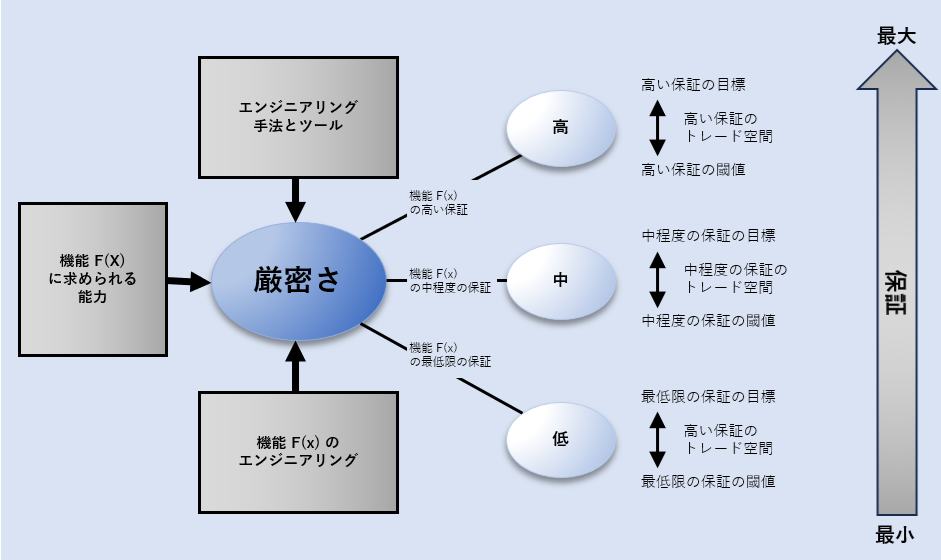

# Appendix F. Trustworthiness and Assurance / 信用性と保証
The trustworthiness of a system is based on the concept of assurance. Assurance is the grounds for justified confidence that a claim or set of claims has been or will be achieved [61]. Justified confidence is derived from objective evidence that reduces uncertainty to an acceptable level and, in doing so, reduces the associated risk (Section F.2).[^85] Evidence is produced by engineering verification and validation methods.[^86] The evidence must be relevant, accurate, credible, and of sufficient quantity to enable reasoned conclusions and consensus among subjectmatter experts that the claims are satisfied. The relationship between evidence and claims can be represented in many ways. Section F.2 discusses these approaches.

“The trust we place in our digital infrastructure should be proportional to how trustworthy and transparent that infrastructure is and to the consequences we will incur if that trust is misplaced.”

-- Executive Order (EO) on Improving the Nation’s Cybersecurity [1]  May 2021 

## F.1. Trust and Trustworthiness / 信用と信用性
As discussed in Section 2.3, trust and trustworthiness are foundational concepts to engineering trustworthy secure systems, to the decisions made to grant trust, and to the extent to which trust is granted based on demonstrated trustworthiness. Trust is a belief that an entity meets certain expectations and can, therefore, be relied upon. A trustworthy entity requires sufficient evidence to support its trustworthiness claims. Trustworthiness is demonstrated based on evidence that supports a stated claim or judgment of being worthy to be trusted [2] [20] [21].

Trust in an entity can occur without a basis for or knowledge of the entity’s trustworthiness. This may occur because (1) there is no alternative (e.g., an individual trusts the components involved in an Internet transaction without knowing anything about the components), (2) the need for trustworthiness is not realized and occurs de facto, or (3) other reasons (e.g., miscommunication or misrepresentation of evidence) [58]. Since the decision to trust an entity is not necessarily based on a judgment of trustworthiness, the decision to trust an entity should consider the significance (i.e., consequences, effects, and impacts) of trust expectations not being fulfilled.
The criteria to grant trust are used to determine the trustworthiness of an entity. Trust granted without establishing the required trustworthiness is a significant contributor to risk.

### F.1.1. Roles of Requirements in Trustworthiness
Trustworthiness judgments are based on expectations to be fulfilled by the entity to be trusted.
The expectations of trustworthiness of the system, inclusive of its elements, are found in the system capability, performance, security, and other requirements. These judgments are

[^85]: This includes risks attributed to poor, incorrect, and unjustified decisions.

[^86]: These methods include combinations of demonstration, inspection, analysis, and testing.

meaningful only to the extent to which the trustworthiness-relevant requirements accurately reflect the problem, accurately define the solution, and can be verified as being satisfied by the solution.

The trustworthiness requirements about security derive from the protection needs, priorities, constraints, and concerns associated with the system’s ability to achieve authorized and intended behaviors and outcomes, deal with adversity, and control loss. The requirements also address the measures used to assess trustworthiness and the evidentiary data and information required to substantiate trustworthiness conclusions and grant trust. The requirements engineering discipline provides the methods, processes, techniques, and tools for this to occur.

“A meaningful claim of trustworthiness cannot be based on an isolated demonstration that the system contains a protection capability assumed to be effective or sufficient. Instead, conclusions about a protection capability must have their basis on evidence that the system was properly specified, designed, and implemented with the rigor needed to deliver a system-level function in a manner deemed to be trustworthy and secure.” [2] 

### F.1.2. Design Considerations
The design for a trustworthy secure system requires the application of principled engineering concepts and methods supported by evidence that provides assurance that all security-relevant claims about the system are satisfied (Section F.2).[^87] Some considerations that apply to achieving trustworthiness in system design are:

* **Composition** 
  Trustworthiness judgments are compositional. They must align with how the set of composed elements provides a system capability. The way that the system is composed from its system elements must include the design principles of Compositional Trustworthiness and, to the extent practical, Structured Decomposition and Composition.

* **States, Modes, and Transitions** 
  Ideally, the implemented system design will result in a system that continually remains in secure states and modes with secure transitions between states and modes (Section 3.2).

  Realistically, the system will have insecure and indeterminant (i.e., unknown if secure or insecure) systems states and modes. The design must account for these cases and provide the capability to transition from insecure and indeterminant states and modes to secure states and modes (Protective Recovery).

* **Failure Propagation** 
  All systems fail at some point. When a failure occurs, another failure scenario or the creation of a new failure scenario should not be triggered or invoked (Protective Failure). Designing without single points of failure (Redundancy) – including not having common mode failures (Diversity) – can help isolate system element failures while providing the required system capabilities. Additionally, the response to failure should not lead to loss or other failures (Protective Recovery).

* **Anomaly Detection** 
  Anomaly Detection provides situational awareness that allows the system to decide and recommend corrective actions to account for actual and potential deviations from accepted norms.

* **Trades** 
  Not every system element has trustworthiness that is sufficient for its intended purpose. A deficiency in trustworthiness can result from:

  * Technical feasibility and practicality issues
  * Cost and schedule issues of what is feasible and practical
  * The limits of certainty (i.e., what is not known, what cannot be known, and what is underappreciated [known or could be known but dismissed prematurely])

  The trade space is the rigorous application of the design principles that provide a basis for the necessary design decisions to maximize the trustworthiness of individual system elements and aggregates of elements. For example, in addressing the feasibility and practicality of cost and schedule issues, the design principle of minimizing the number of system elements that must be trusted (Minimal Trusted Elements) is applied. This reduces the size and scope of the effort and potentially reduces the expense of generating evidence of trustworthiness.

[^87]: Constraints and claims are expressed in terms of functional correctness, strength of function, concerns for asset loss and consequences, and the protection capability derived from adherence to standards or from the use of specific processes, procedures, or methods.

## F.2. Assurance / 保証
Assurance is the grounds for justified confidence that a claim or set of claims has been or will be achieved [61]. Assurance is a complex and multi-dimensional property of the system that builds over time. Assurance must be planned, established, and maintained in alignment with the system throughout the system life cycle.

Adequate security judgments should be based on the level of confidence in the ability of the system to protect itself against asset loss and the associated consequences across all forms of adversity.[^88] It cannot be based solely on individual efforts, such as demonstrating compliance, functional testing, or adversarial penetration tests. Judgments include what the system cannot do, will not do, or cannot be forced to do. These judgments of non-behavior must be grounded in sufficient confidence in the system’s ability to correctly deliver its intended function in the presence and absence of adversity and to do so when used in accordance with its design intent.

The needed evidentiary basis for such judgments derives from well-formed and comprehensive evidence-producing activities that address the requirements, design, properties, capabilities, vulnerabilities, and effectiveness of security functions. These activities include a combination of demonstration, inspection, analysis, testing, and other methods required to produce the needed evidence. The evidence acquired from these activities informs reasoning by qualified subjectmatter experts to interpret the evidence to substantiate the assurance claims made while considering other emergent properties that the system may possess.

[^88]: The term adversity refers to those conditions that can cause a loss of assets (e.g., threats, attacks, vulnerabilities, hazards, disruptions, and exposures).

### VENEER SECURITY
Assurance is difficult but necessary.

“I’ve covered a lot of material in this book, some of it quite tricky. But I’ve left the hardest parts to the last. First, there’s the question of assurance …“ [5].

Veneer security is security functionality provided without corresponding assurance so that the functionality only appears to protect resources when it does not. Veneer security results in a false sense of security and, in fact, increases risk due to the uncertainty about the behavior and outcomes produced by the security functionality in the presence and absence of adversity. Veneer security must be avoided [62].

Compliance is a form of “veneer security.” While compliance may have an important informing role in judgments of trustworthiness, compliance-based judgments – like other forms of veneer security – do not suffice as the sole evidentiary basis for assurance and the associated judgments of trustworthiness.

### F.2.1. Security Assurance Claims
From a security perspective, a top-level claim addresses freedom from the conditions that cause asset loss and the associated consequences. Specifically, this means the system will adequately contribute to freedom from the conditions that cause asset loss and the associated consequences.

Top-level claims decompose in a structured manner into subclaims about the desired attributes of a trustworthy secure system. Subclaims address the requirements, design, implementation, methods, and adversities that demonstrate that the system adequately contributes to ensuring only authorized and intended system behaviors and outcomes. These subclaims are derived from concerns about the completeness and accuracy of stakeholder and system requirements,[^89] enforcement of the security policy, proper implementation of the design, proper maintenance of the system, the usability of the system,[^90] and the avoidance, minimization, and mitigation of defects, errors, and vulnerabilities.[^91] Other subclaims may exist involving the ability to exhibit predictable behavior while operating in secure states in the presence and absence of adversity and the ability to recover from an insecure state. Claims can be expressed in terms of functional correctness, strength of function, and the protection capability derived from adherence to standards and/or from the use of specific processes, procedures, and methods.

#### LEARNING FROM SAFETY
The NASA System Safety Handbook [6] describes the relevant claims to be met in terms of the top-level claim that the system is adequately safe with subclaims, including that the system is designed to be as safe as reasonably practicable, built to be as safe as reasonably practicable, and operated as safely as reasonably practicable.

[^89]: Claims are not expressed solely as a restatement of the security functional and performance requirements. Doing so only provides assurance that the security requirements are satisfied with the implicit assumption that the requirements are correct, provide adequate coverage, and accurately reflect stakeholder needs and concerns.

[^90]: Most system failures have a human component. Thus, assurance must consider human frailty [5]. Operator behavior is a product of the environment (including its systems) in which it occurs [36].

[^91]: Not all vulnerabilities can be mitigated to an acceptable level. There are three classes of vulnerabilities in systems: (1) vulnerabilities whose existence is known and either eliminated or made to be inconsequential, (2) vulnerabilities whose existence is known but that are not sufficiently mitigated, and (3) unknown vulnerabilities that constitute an element of uncertainty. That is, the fact that the vulnerability has not been identified should not give increased confidence that the vulnerability does not exist. Determining the effect of vulnerabilities that are in the delivered system and the risk posed by those vulnerabilities and accepting uncertainty about the existence of a vulnerability that will only become known over time are important aspects that are addressed by assurance.

### F.2.2. Approaches to Assurance
There are three general approaches to assurance. These assurance approaches can vary based on the type of evidence, how the evidence is acquired, the strength of the judgments made based on the acquired evidence, and the extent to which the assurance matches decision-making needs.

From weakest to strongest, the assurance approaches are axiomatic, analytic, and synthetic.
* **Axiomatic Assurance** (assurance by assertion) is based on beliefs accepted on faith in an artifact or process. The beliefs are often accepted because they are not contradicted by experiment or demonstration. Axiomatic assurance is not suited to complex scenarios [62].
  * Demonstration of conformance and compliance are types of axiomatic assurance. While useful, they are not well-suited as the sole basis of assurance for complex scenarios.
* **Analytic Assurance** (assurance by test and analysis) derives from testing or reasoning to justify conclusions about properties of interest. Belief is relocated from an artifact or process to trust in some method of analysis. The feasibility of establishing an analytic basis depends on the amount of work involved in performing the analysis and on the soundness of any assumptions underlying that analysis. Analytic methods are most relevant in a model that spans all relevant uses and all interfaces to the environment. That is, the model must not ignore too many details.
  * Testing demonstrates the presence but not the absence of errors and vulnerabilities.
Testing and analyses will have uncertainty that cannot be ignored, especially when they lack comprehensiveness. Uncertainty contributes to risk.

* **Synthetic Assurance** (assurance by structured reasoning) derives from the method of composition of the “components of assurance” (i.e., the assurance derives from the manner of synthesis of the constituent parts). It requires that assurance be a consideration at every step of design and implementation, from the smallest components to the final subsystem realization.
  * The assurance case described in [30] is an example of structured reasoning (Section 4.3).
Structured reasoning serves to fill the gaps associated with the axiomatic and analytic assurance approaches. Since synthetic assurance is based on the expert judgment of available evidence, it is not complete. However, synthetic assurance does further reduce uncertainty and, thus, reduces risk.

Assurance depends on the quality of the evidence used in arguments demonstrating that claims about the system are satisfied. Assurance evidence can be obtained either directly through measurement, testing, observation, or inspection or indirectly through analysis, including the analysis of data obtained from measurement, testing, observation, or inspection. Evidence must have sufficient quality in accuracy, credibility, relevance, rigor, and quantity. The accuracy, credibility, and relevance of evidence should be confirmed prior to its use. For example, some evidence can support arguments for strength of function, others for negative requirements (i.e., what will not happen), and still other evidence for qualitative properties.

#### ASSURANCE CASE
An assurance case is a reasoned, auditable artifact that is created to support the contention that a top-level claim is satisfied. The assurance case includes systematic argumentation, evidence, and explicit assumptions that support the claim.

An assurance case contains the following elements [30]:
* One or more claims about properties
* Arguments that logically link the evidence and any assumptions
* A body of evidence
* Justification of the choice of a top-level claim and the method of reasoning

Assurance cases have numerous advantages over other means for obtaining confidence, such as in the areas of comprehension, informing needed allocation responsibilities, information organization, and robust due diligence [63]. These advantages were greater in areas with otherwise insufficient methods for achieving high assurance. Additionally, assurance cases were determined to be more efficient for complex and novel systems, as well as systems in need of high assurance.

Many formalizations and tools for building assurance cases have been developed in recent years, including the Goal Structuring Notation (GSN) [64] and NASA’s AdvoCATE: Assurance Case Automation Toolset [65].

### F.2.3. Assurance Needs
Assurance is a need that is to be engineered and satisfied similar to the need to engineer the system capability to satisfy specified capability needs. Assurance needs for trustworthy secure systems are grounded in the concerns of loss and adverse effects due to intentional and unintentional adversity (Commensurate Trustworthiness, Substantiated Trustworthiness, Commensurate Rigor). Assurance needs include the evidence-basis for reasoning, the degree of rigor to acquire and interpret the evidence, and the selection of the methods, tools, and processes used throughout the system life cycle. Similar to capability and performance needs, assurance needs, expectations, priorities, and constraints should be expressed as system requirements and achieved, tracked, and maintained within the systems engineering effort.

Assurance needs determine the type of evidence and the rigor associated with the activities, methods, and tools used to acquire the evidence to satisfy the following cases:
* *What is to be accomplished in the systems engineering effort*: The realization of the design for a secure system
* *The means to conduct the systems engineering effort*: The methods, processes, and tools employed (driven by rigor and assurance objectives) to realize the design for a secure system
* *The results of the systems engineering effort*: The substantiated effectiveness of the realized design of the secure system

#### CONFIDENCE MAY BE NEGATIVE
Assurance evidence can support a conclusion that a stated claim is not achieved or that there is an insufficient basis to conclude that the claim is supported or not supported. In either case, the assurance is negative relative to the goal of substantiating the claim. That is, the system or some part of the system is not sufficiently trustworthy and should not be trusted relative to its specified function without further action.

Assurance needs can vary and constitute a trade space that must be managed similar to how capability and performance needs can vary. The degree of rigor is the primary means of varying assurance. As shown in Figure 17, a direct relationship exists between the degree of rigor and assurance and the stakeholder’s assessment of the effects of asset loss. The assurance trade space includes the following considerations:
* Cost, schedule, and performance
* Architecture and design decisions
* Selection of technology and solutions
* Selection and employment of methods and tools
* Qualifications necessary for subject-matter experts

Requirements analysis across stakeholder and system requirements determines the threshold degree of rigor that is required. When a system cannot practicably meet the needed degrees of rigor, stakeholders should have a means to determine if they will accept the associated risk.

Fig. 17. Assurance and Degree of Rigor in Realizing a Capability Need

The highest levels of rigor across systems can require formal methods – techniques that model systems as mathematical entities to enable rigorous verification of the system’s properties through mathematical proofs. Formal methods depend on formal specifications (i.e., statements in a language whose vocabulary, syntax, and semantics are formally defined) and a variety of models, including a formal security policy model (i.e., a mathematically rigorous specification of a system’s security policy [Appendix C]).

Due to associated costs and complexity, formal methods are typically limited to engineering efforts where only the highest levels of assurance are needed, such as the formal modeling, specification, and verification of security policy and the implementation that enforces the policy (Section D.4.2). In this case, the security policy model is verified as complete for its scope of control and as self-consistent. The verified security policy model then serves as a foundation to verify the models of the design and implementation of the mechanisms that provide for decisionmaking and the enforcement of those decisions.
