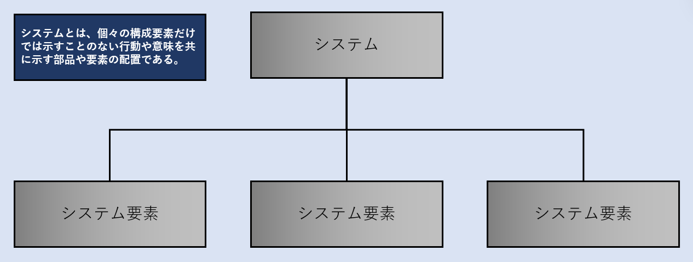
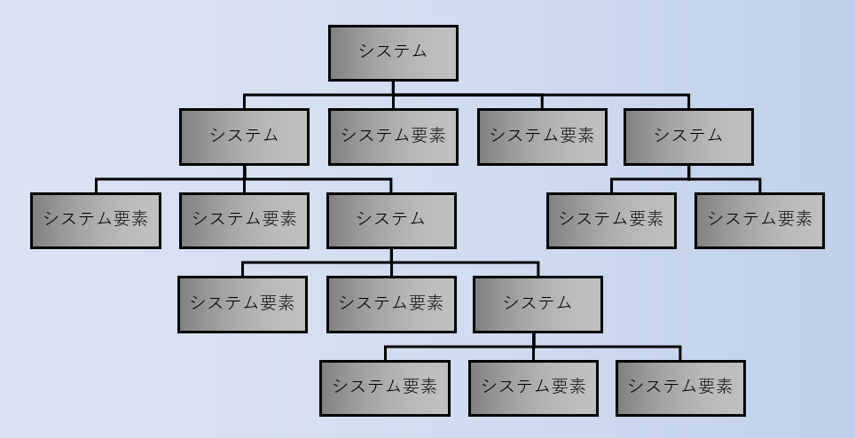
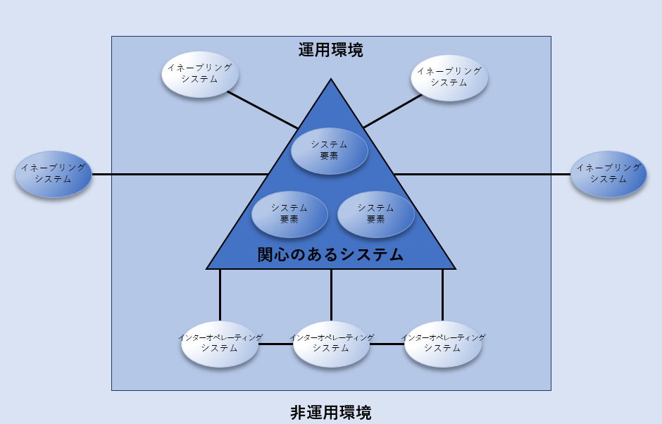

# Systems Engineering Overview / システムズ エンジニアリングの概要
> This chapter presents system, systems engineering, trust, and trustworthiness concepts that provide the foundation for engineering trustworthy secure systems.

本章では、信用できる安全なシステムを設計するための基盤となる、システム、システムズ エンジニアリング、信頼、および信頼性の概念を示す。

## System Concepts / システムの概念
> Many system concepts are important to inform engineering trustworthy secure systems. This includes what constitutes a system, the structure of a system, categories of systems, and the concept of a system of systems.

多くのシステムの概念が、信用できる安全なシステムを設計する上で重要となる。これには、システムを構成するもの、システムの構造、システムのカテゴリー、そしてシステムのシステムという概念が含まれる。

### Systems and System Structure / システムズとシステム構造
> A system[^9] is an arrangement of parts or elements that together exhibit a behavior or meaning that the individual constituents do not. The properties of a system (i.e., attributes, qualities, or characteristics) emerge from the system’s parts or elements and their individual properties, as well as the relationships and interactions between and among the parts or elements, the system, and its environment [3]. An engineered system is designed or adapted to interact with an anticipated operational environment to achieve one or more intended purposes while complying with applicable constraints [3]. Figure 1 shows the basic structure of a system, including its constituent system elements.[^10] [^11]

システム[^9j]とは、個々の構成要素では示すことのない振る舞いや意味を、部品または要素が一緒になって示す配置である。システムの特性（すなわち、属性、資質、または特徴）は、システムの部品や要素およびそれらの個々の特性、部品や要素、システム、そしてその環境との関係や相互作用から生じる[3]。エンジニアリングされたシステムは、想定された運用環境との相互作用を設計または適応させ、適用可能な制約に従いながら一つ以上の意図された目的を達成するようにされている[3]。図1は、システムの基本構造と、その構成システム要素を示している[^10j] [^11j]。

Fig. 1. Basic System and System Element Relationship

> The purpose of a system is to deliver one or more capabilities. The capabilities may directly or indirectly interact with, control, or monitor physical, mechanical, hydraulic, or pneumatic devices or other systems or capabilities, or it may provide the ability to create, access, manipulate, transmit, store, or share resources, such as data and information.

システムの目的は、一つまたは複数の能力を提供することである。これらの能力は直接的に、または間接的に、物理的、機械的、油圧的、または空気圧的な装置や他のシステムや能力と相互作用し、制御し、または監視することができる。または、データや情報などのリソースを作成、アクセス、操作、送信、保存、または共有する能力を提供することもある。

[^9]: > Examples of systems include information systems, communications systems, financial systems, manufacturing systems, transportation systems, logistics systems, medical systems, weapons systems, mechanical systems, space systems, industrial control systems (ICS), optical systems, or electrical systems. Systems can be physical or conceptual, use information technology (IT) or operational technology (OT), include humans, be cyber-physical, and leverage Internet of Things (IoT) or other technologies.

[^9j]: システムの例には、情報システム、通信システム、金融システム、製造システム、交通システム、物流システム、医療システム、兵器システム、機械システム、宇宙システム、産業制御システム（ICS）、光学システム、または電気システムが含まれる。システムは物理的または概念的であり、情報技術（IT）または運用技術（OT）を使用し、人間を含むことがあり、サイバーフィジカルであり、モノのインターネット（IoT）や他の技術を活用することができる。

[^10]: > A system element can be a discrete component, product, service, subsystem, system, organization, human, infrastructure, or enterprise. System elements are implemented by hardware, software, and firmware that perform operations on information or data; physical structures, devices, and components in the operational environment; and the people, processes, and procedures for operating, sustaining, and supporting the elements.

[^10j]: 別個のコンポーネント、製品、サービス、サブシステム、システム、組織、人間、インフラストラクチャー、または企業がシステム要素となりうる。システム要素は、情報やデータに対して操作を実行するハードウェア、ソフトウェア、ファームウェアによって実装される。これには運用環境内の物理的構造物、装置、コンポーネント、および要素を運用、維持、支援するための人々、プロセス、手続きが含まれる。

[^11]: > Systems with few or no active functions (e.g., physical infrastructure) may also exhibit assured trustworthiness. For example, the interstate highway system employs safety barriers such as Jersey walls (a system element) that contribute to the transportation system’s trustworthiness.

[^11j]: アクティブな機能が少ない、または全くないシステム（例えば、物理的インフラストラクチャー）も、信用性を確実に示すことがある。たとえば、州間高速道路システムは、コンクリート防護柵（システム要素）などの安全バリアを採用しており、これが交通システムの信用性に貢献している。

> Figure 2 is a general hierarchical model for the representation of a system. Not all systems, such as networks, are hierarchical in nature. Non-hierarchical systems have models that can more accurately reflect the relationships of their constituent elements. A system element may itself be considered a system (i.e., comprised of other system elements). Realizing a system of interest involves recursively resolving its structure to the point where understandable and manageable system elements can be implemented (i.e., developed, bought, or reused) and subsequently integrating those elements into the system.

図2は、システムの表現のための一般的な階層的モデルである。すべてのシステムが、例えばネットワークのように、階層的な性質を持っているわけではない。非階層的システムには、構成要素の関係をより正確に反映できるモデルがある。システム要素自体がシステム（つまり、他のシステム要素で構成される）とみなされることもある。関心のあるシステムを実現するには、理解可能で管理可能なシステム要素が実装される（つまり、開発されたり、購入されたり、再利用されたりする）点までその構造を再帰的に解決し、その後、これらの要素をシステムに統合する。

Fig. 2. Model for a System and its Elements

> A system of systems is a system whose interacting system elements are themselves systems. It provides a unique capability that the constituent systems cannot provide on their own. A system of systems may include inter-system infrastructure, facilities, and processes necessary to enable the constituent systems to integrate or interoperate [10].

システム・オブ・システムズは、相互作用するシステム要素自体がシステムであるシステムである。これは、構成システム単独では提供できない独自の能力を提供する。システム・オブ・システムズには、構成システムが統合または相互運用するために必要な、システム間のインフラストラクチャー、施設、プロセスが含まれることがある[10]。

### Interfacing, Enabling, and Interoperating Systems / インターフェイスしている、有効化、およびシステム間相互運用

> Interfacing systems are systems that interact with the system of interest. Interfacing systems have an interface for exchanging data, energy, or other resources with the system of interest. An interfacing system exchanges resources with the system of interest during one or more system life cycle stages, such as a system that interfaces for maintenance purposes or a system used to develop the system of interest. The relationships with interfacing systems can be either bidirectional or one way. Interfacing systems have two specific subsets: enabling systems and interoperating systems.

インターフェイシング システムは、関心のあるシステムと相互作用するシステムである。インターフェイシング システムは、関心のあるシステムとデータ、エネルギー、または他のリソースを交換するためのインターフェイスを持っている。インターフェイシング システムは、メンテナンス目的でインターフェースを行うシステムや、関心のあるシステムを開発するために使用されるシステムなど、一つ以上のシステムライフサイクルステージ中に関心のあるシステムとリソースを交換する。インターフェイシング システムとの関係は、双方向または一方向のいずれかである。インターフェイシング システムには、イネーブリング システムとインターオペレーティング システムという二つの具体的なサブセットがある。

> * Enabling systems provide the essential services required to create and sustain the system of interest. Examples of enabling systems include software development environments, production systems, training systems, and maintenance systems.

* イネーブリング システムは、関心のあるシステムを作成、維持するために必要となる基本的なサービスを提供する。イネーブリング システムの例として、ソフトウェア開発環境、生産システム、訓練システム、保守システムが挙げられる。

> * Interoperating systems interact with the system of interest for the purpose of jointly performing a function.

* インターオペレーティング システムは、共同で機能を実行する目的で、関心のあるシステムと相互作用する。

> Figure 3 illustrates the relationship between the system of interest and its interfacing systems in both operational and non-operational (external) environments.

図3は、運用環境および非運用（外部）環境の両方において、関心のあるシステムとそのインターフェイシング システムとの関係を示している。

Fig. 3. System of Interest and Interfacing Systems

## Systems Engineering Foundations / システムズ エンジニアリングの基礎
> Systems engineering is a transdisciplinary[^12] and integrative approach to enabling the successful realization, use, and retirement of engineered systems. It employs systems principles and concepts, as well as scientific, technological, and management methods to achieve such systems [12]. Systems engineering is system-holistic in nature, whereby the contributions across multiple engineering and specialty disciplines are evaluated and balanced to produce a coherent system capability. Systems engineering applies systems science and systems thinking[^13] to satisfy the often-conflicting needs and priorities of stakeholders within the constraints of cost, schedule, performance, and effectiveness. The objective is to limit uncertainty and thereby manage risk.

[^12]: > As noted in [11], transdisciplinary approaches reach “beyond disciplines to find and exploit connections to solve complex problems. Transdisciplinary thinking encourages thinking in terms of new relationships among traditionally distinct disciplines and focusing on new concepts that might arise from such thinking.” 

[^12j]: 

[^13]: > Systems science is an interdisciplinary field that studies complex systems in nature, society, and science. It aims to develop interdisciplinary foundations that are applicable in a variety of areas, such as social sciences, engineering, biology, and medicine. Systems thinking is a discipline of examining wholes, interrelationships, and patterns [13].

[^13j]: 

> Systems engineering is outcome-oriented and leverages engineering processes to realize a system while effectively managing complexity and serving as the principal integrating mechanism for the technical, management, and support activities related to the engineering effort. Finally, systems engineering is data- and analytics-driven to ensure that all decisions and trades are guided and informed by data produced by analyses conducted with an appropriate level of fidelity and rigor.

> Systems engineering efforts are complex, system-specific, and context-dependent,[^14] requiring close coordination between the engineering team and stakeholders throughout the system life cycle stages.[^15] While systems engineering is typically considered in terms of its developmental role as part of capability acquisition, systems engineering efforts and responsibilities do not end once a system completes development and is transitioned to the operational environment for dayto-day use. Stakeholders responsible for the system’s utilization, support, and retirement provide data to the systems engineering team on an ongoing basis. This data captures the experiences, problems, and issues associated with the operation, maintenance, and sustainment of the system.

> Stakeholders also advise the engineering team on system enhancements and improvements made or desired. In addition, field engineering provides on-site, full-system life cycle engineering support for operations, maintenance, and sustainment organizations.

> There are many additional resources available that provide more in-depth examinations of systems engineering.[^16] Such discussions are beyond the scope of this publication.

## Trust and Trustworthiness / 信用と信用性
> The concepts of trust and trustworthiness are foundational to engineering trustworthy secure systems, to the decisions made to grant trust, and to the extent that trust is granted based on demonstrated trustworthiness. Trust is a belief that an entity meets certain expectations and can be relied upon. The terms belief and can imply that trust may be granted to an entity whether the entity is trustworthy or not. A trustworthy entity is one for which sufficient evidence exists to support its claimed trustworthiness. Thus, trustworthiness is the demonstrated ability and, therefore, the worthiness of an entity to be trusted to satisfy expectations, including satisfying expectations in the face of adversity. Since trustworthiness is something demonstrated, it is based on evidence that supports a claim or judgment of an entity being worthy of trust [2] [20] [21].

> Since trust is not necessarily based on a judgment of trustworthiness, the decision to trust an entity should consider the significance (i.e., consequences, effects, and impacts) of expectations not being fulfilled because of non-performance – whether due to incompetence, deficiency, or failure. Trust that is granted without establishing the required trustworthiness is a significant contributor to risk. The concepts of trust and trustworthiness are discussed in Appendix F.

[^14]: > The International Council on Systems Engineering (INCOSE) notes in [14] that “systems engineering in application is specific to stakeholder needs, solution space, resulting system solution(s), and context throughout the system life cycle” and "systems engineering influences and is influenced by internal and external resource, political, economic, social, technological, environmental, and legal factors.” 

[^14j]: 

[^15]: > Nomenclature for stages of the system life cycle varies but often includes concept analysis; solution analysis; technology maturation; system design and development; engineering and manufacturing development; production and deployment; training, operations, and support; and retirement and disposal.

[^15j]: 

[^16]: > INCOSE offers a systems engineering handbook [15] and Systems Engineering Book of Knowledge [13] as general resources. The National Aeronautical and Space Administration (NASA) also offers systems engineering material as it is applied within the NASA community.  Publications include the NASA Systems Engineering Handbook [17] and two volumes of expanded systems engineering guidance [18] [19].

[^16j]: 

## ENGINEERING FOR TRUST
> In January 2022, INCOSE released the Systems Engineering Vision 2035 [16]. It is intended to inspire, guide, and inform the strategic direction for the global systems engineering community. A core element identified for the future state of systems engineering is increased confidence in systems to improve the practice of engineering trusted systems.

> As noted in [7], a key problem to address in realizing Vision 2035 is that “systems security has moved from its traditional focus on trust to a more singular focus on risk.” The need is to prove a level of system security through evidence-based assurance.
